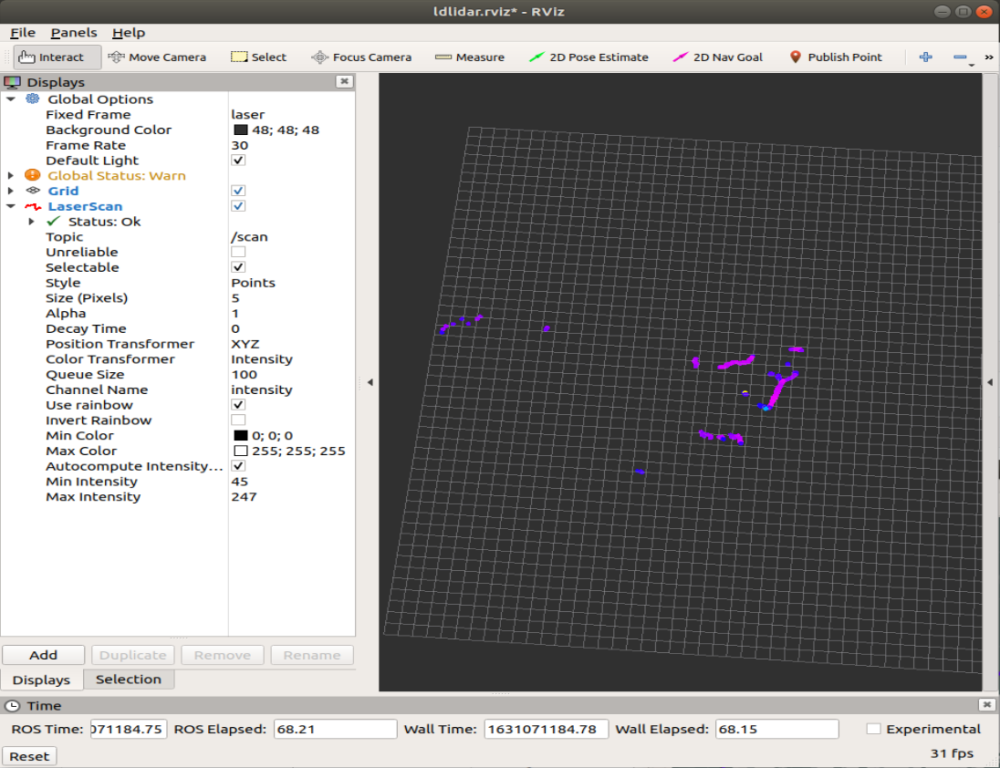
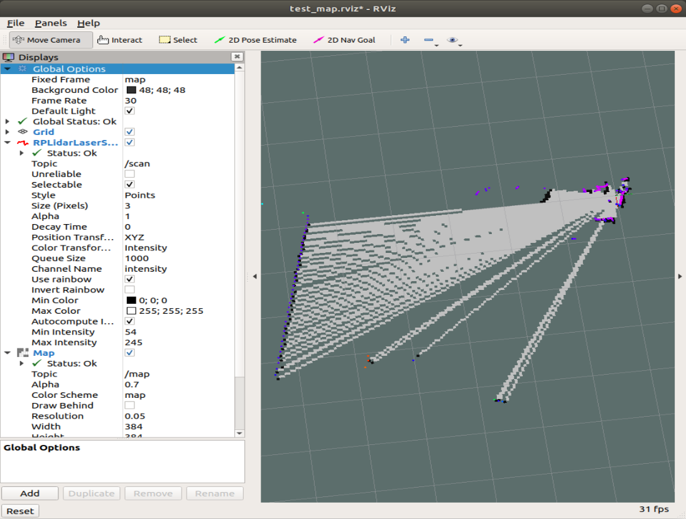

# LD06启动方法

## 1、运行环境

操作系统：Ubuntu 18.04 LTS
ROS版本：melodic
设备：jetson nano 、树莓派、PC
首先将功能包移植到工作空间下；选择下面测试方法任意一种即可。

```python
catkin_make              # 编译工作空间
source devel/setup.bash  # 更新环境变量
```

安装依赖库

```
sudo apt-get install ros-melodic-libuvc-* ros-melodic-libuvc ros-melodic-mbf-msgs ros-melodic-bfl ros-melodic-serial freeglut3 freeglut3-dev libudev-dev libvorbis-dev
```

## 2、雷达测试方法

```python
roslaunch ldlidar ld06.launch 
# 或
rosrun ldlidar ldlidar 
```

启动rviz

```
roslaunch ldlidar rviz_ld06.launch
```



## 3、建图测试方法

安装gmapping功能包

```
sudo apt install ros-melodic-gmapping
```

一键启动

```
roslaunch ldlidar test_gmapping.launch
```


